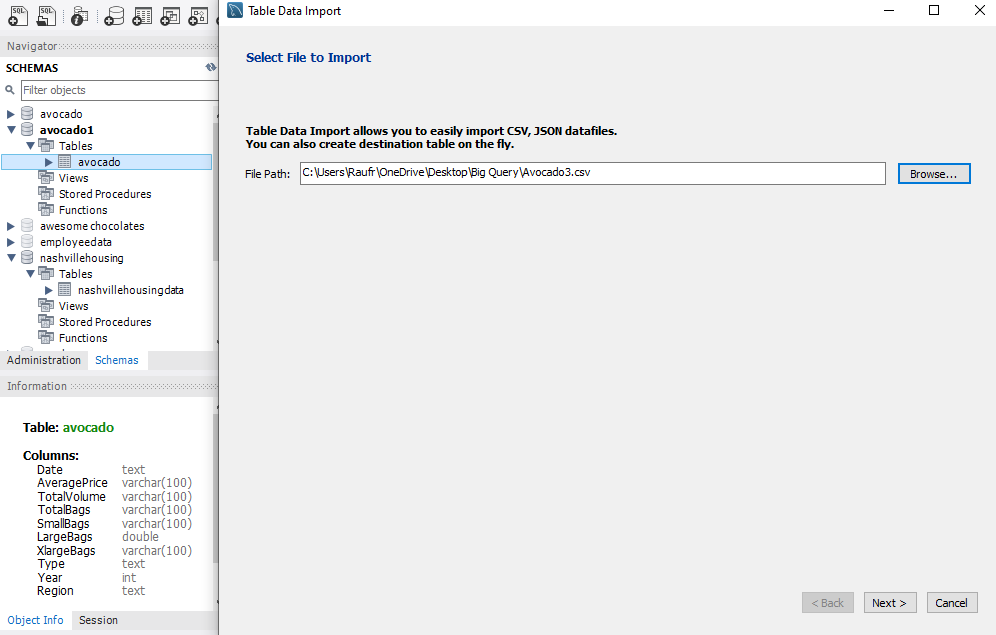
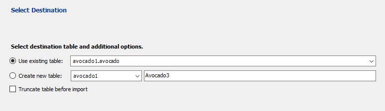
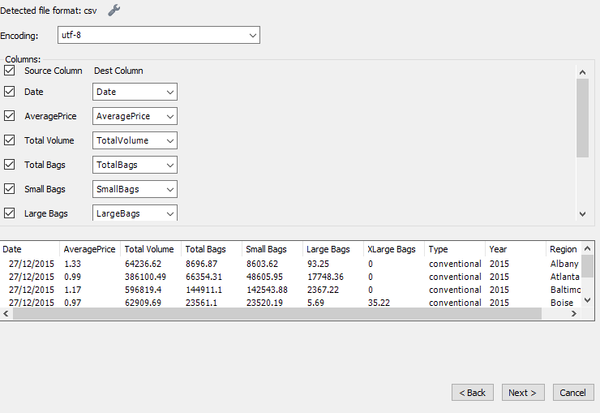
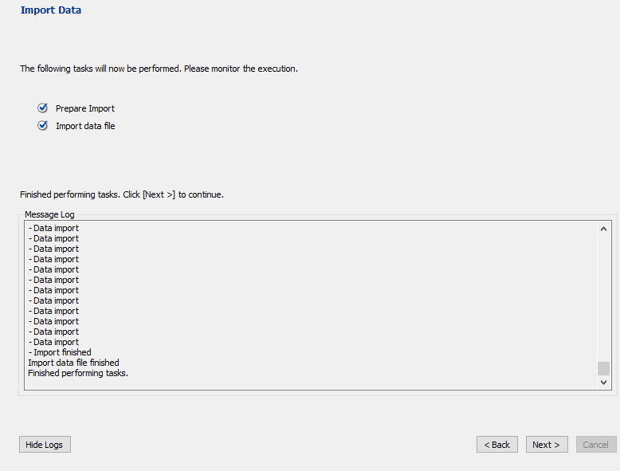

# Importing-Data-into-MySQL
In this post, I will walk you through the two possible ways of importing your CSV/JSon files into MySQl Workbench.

**Note:** *MySQL only allows CSV and Json files to be imported into its database, this means if your file is in Excel format, you need to save it as CSV before you start your import.*

##  Using the Table Data Import Wizard

Below are the steps needed to be followed in order to use this method

- Create the Database
``` sql
CREATE DATABASE Avocado1
```
- Create a Table with the names of columns contained in your data
``` sql
CREATE TABLE Avocado1.Avocado(
	Date Text,
    AveragePrice varchar(100),
    TotalVolume varchar(100),
    TotalBags varchar(100),
    SmallBags varchar(100),
    LargeBags double,
    XlargeBags varchar(100),
    Type Text,
    Year INT,
    Region Text
);
```
- Right-click on the table & select the 'table data import wizard', choose your file location
 
   

- Match the columns



- Click next & wait for the data to load



### The Pros of Using The Table Data Import Wizard

- It is not compulsory to create a table before importing the data as you can choose the create new table option during the importation process
  
- Your data file can be located anywhere on your PC as you have the flexibility of choosing the file location during importation

### The Cons of Using The Table Data Import Wizard

- You have to define any numerical columns that contain a null value as either TEXT or VARCHAR otherwise the null rows would not be imported
  
- It takes longer time for the data to import(15-20mins to import my 18249 rows of data)

## Loading Data through the Data Infile option

- Create the database
``` sql
CREATE DATABASE Avocado;
```
- Create a Table with the names of columns contained in your data
- Locate your  PC Local disk<Program Data<MySQL<MySQL Server<Uploads
- Move your CSV file to the uploads & copy the file path as shown in frame2
