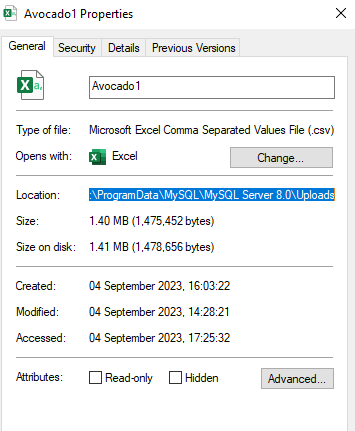

# Importing-Data-into-MySQL
In this post, I will walk you through the two possible ways of importing your CSV/JSon files into MySQl Workbench.

**Note:** *MySQL only allows CSV and Json files to be imported into its database, this means if your file is in Excel format, you will need to save it as CSV before you start your import.*

##  Using the Table Data Import Wizard

Below are the steps needed to be followed in order to use this method

- Create the Database
``` sql
CREATE DATABASE Avocado1;
```
- Create a Table with the names of columns contained in your data
``` sql
CREATE TABLE Avocado1.Avocado(
    Date Text,
    AveragePrice varchar(100),
    TotalVolume varchar(100),
    TotalBags varchar(100),
    SmallBags varchar(100),
    LargeBags double,
    XlargeBags varchar(100),
    Type Text,
    Year INT,
    Region Text
);
```
- Right-click on the table & select the 'table data import wizard', choose your file location
 
   

- Match the columns


- Click next & wait for the data to load


### The Pros of Using The Table Data Import Wizard

- It is not compulsory to create a table before importing the data as you can choose the create new table option during the importation process
  
- Your data file can be located anywhere on your PC as you have the flexibility of choosing the file location during importation

### The Cons of Using The Table Data Import Wizard

- You have to define any numerical columns that contain a null value as either TEXT or VARCHAR otherwise the null rows would not be imported
  
- It takes longer time for the data to import(15-20 mins to import my 18249 rows of data)

## Loading Data through the Data Infile option

- Create the database
``` sql
CREATE DATABASE Avocado;
```
- Create a Table with the names of columns contained in your data
```sql
CREATE TABLE Avocado.Avocado1(
	Date Text,
    AveragePrice varchar(100),
    TotalVolume varchar(100),
    TotalBags varchar(100),
    SmallBags varchar(100),
    LargeBags double,
    XlargeBags varchar(100),
    Type Text,
    Year INT,
    Region Text
);
```

- Locate your PC Local disk<Program Data<MySQL<MySQL Server<Uploads

	- *if you can't find the Program Data, it is most likely that it is hidden, go to view and enable hidden files*
  
	- *there are cases whereby the Program file is not the default secure location for Mysql server on your PC, you can run the code below to know which one is 				applicable to you*
  
	 ```sql
	 SHOW VARIABLES LIKE "secure_file_priv";
	 ```
  
- Move your CSV file to the Uploads & copy the file path as shown below


 
- Use double \ for your file path then add the name of your file.csv as in the code below:

```sql
LOAD DATA INFILE '\\ProgramData\\MySQL\\MySQL Server 8.0\\Uploads\\Avocado1.csv'
INTO TABLE Avocado.avocado1
FIELDS TERMINATED BY ',' 
ENCLOSED BY '"'
LINES TERMINATED BY '\r\n'
IGNORE 1 LINES; -- not needed if your data doesn't have column headers
```

- Run the codes and your data will be imported

### The Pros of Using The Data Infile Option

- It is faster as it took about 2 seconds to import 18249 rows

### The Cons of Using The Data Infile Option
- You also need to define any numerical columns that contain a null value as either TEXT or VARCHAR
  
- It is compulsory to create a table before importing your data
  
- Your data file must be moved to the Program Data for the server to be able to access and import it because accessing the data from anywhere on your PC using the this method has been disabled by MySQL

### Bonus

It was discovered that the **Data Infile option** cannot access data from local areas on the PC but there are ways this can be bye passed

*Please note that the method may work or may still not allow you access the file from anywhere on your computer*

- Check to see if your Local infile load is on, this will enable you to load the csv file from anywhere in your PC
```sql
Show global variables like 'local_infile';
```

- If not On, turn it on using:
```sql
SET global local_infile=true;
```

-Add LOCAL to the same code we used earlier as shown below, then run the code:
```sql
LOAD DATA LOCAL INFILE '\Users\Raufr\OneDrive\Desktop\Big QueryAvocado1.csv' 		-- notice we added Local to this line and used a file path from our PC 
INTO TABLE Avocado.avocado1
FIELDS TERMINATED BY ',' 
ENCLOSED BY '"'
LINES TERMINATED BY '\r\n'
IGNORE 1 LINES; -- not needed if your data doesn't have column headers
```

If MySQL allow, the code will run and the data would be imported in few seconds and if not, you will have to stick with using the default **Load Data Infile** by moving your file to a specified location or you use the first method of **Table Data Import Wizard** to load your data. The decision is totally up to you.

***
Thanks for Reading. I hope you found it useful
